# 🎓 Ingpoglb - Portal Informasi Kampus

<div align="center">
  <a href="https://global.ac.id/" target="_blank">
    
  </a>
</div>

<div align="center">
  Institut Teknologi dan Bisnis Bina Sarana Global <br>
  FAKULTAS TEKNOLOGI INFORMASI & KOMUNIKASI <br>
  <a href="https://global.ac.id/">https://global.ac.id/</a>
</div>


##  Project UAS
  - Mata Kuliah : Aplikasi Mobile
  - Kelas : TI 23 SE 1 
  - Semester : Ganjil
  - Tahun Akademik: 2025 - 2026

---

**Project UAS Mobile Programming - Kelompok 4 Trio**

**Ingpoglb** adalah aplikasi mobile berbasis Flutter yang dirancang sebagai portal akademik mahasiswa modern. Aplikasi ini mempermudah mahasiswa untuk mengakses jadwal kuliah, informasi keuangan, profil tim, serta menerima pengumuman kampus secara *real-time* melalui notifikasi.

---

## 🔥 Fitur Utama

### 1. 🔐 Autentikasi & Keamanan
* **Login System:** Terintegrasi penuh dengan **Firebase Authentication**.
* **Splash Screen Pintar:** Logika *Check First Seen* menggunakan `SharedPreferences`.
    * *Pengguna Baru:* Splash 1 -> Onboarding -> Login.
    * *Sudah Login:* Langsung diarahkan ke Dashboard.
    * *Sudah Logout:* Langsung diarahkan ke Login Page.

### 2. 🏠 Dashboard Mahasiswa (Portal)
* **Dynamic Greeting:** Sapaan personal ("Halo, [Nama]!") yang berubah sesuai akun login.
* **Banner Informasi:** 4 Banner (Jadwal UAS, Ujian Susulan, dll) yang dapat diklik untuk detail.
* **Menu Grid:** Navigasi cepat ke fitur Jadwal, Nilai, Presensi, dan Keuangan.
* **UI Modern:** Menggunakan tema gradasi warna *Biru* (`#304D6D` to `#63ADF2`).

### 3. 🔔 Notifikasi Real-time (FCM)
* **Firebase Cloud Messaging:** Mendukung push notification baik saat aplikasi dibuka (*foreground*) maupun ditutup (*background*).
* **Notification Badge:** Indikator angka merah pada ikon lonceng saat ada pesan baru.
* **Notification History:** Halaman khusus untuk melihat riwayat notifikasi yang masuk.

### 4. 👤 Profil & Tim
* **Dynamic Profile:** Nama dan inisial di Drawer berubah otomatis sesuai email yang login.
* **Team Profile:** Halaman khusus yang menampilkan daftar anggota Kelompok 4 Trio.
* **Logout:** Fitur keluar aplikasi dengan pembersihan sesi yang aman.

---

## 🛠️ Teknologi yang Digunakan

* **Framework:** [Flutter](https://flutter.dev/) (Dart SDK)
* **Backend:** [Firebase](https://firebase.google.com/)
    * **Auth:** Manajemen User (Login/Logout).
    * **Cloud Messaging (FCM):** Pengiriman Notifikasi.
* **State Management:** `setState` (Native).
* **Local Storage:** `shared_preferences` (Menyimpan status onboarding).
* **UI Components:** `google_fonts` (Poppins), `lottie` (Animasi), `badges` (Notifikasi).

---

## 📸 Screenshot Aplikasi

**Splash Screen**
<p align="center">
  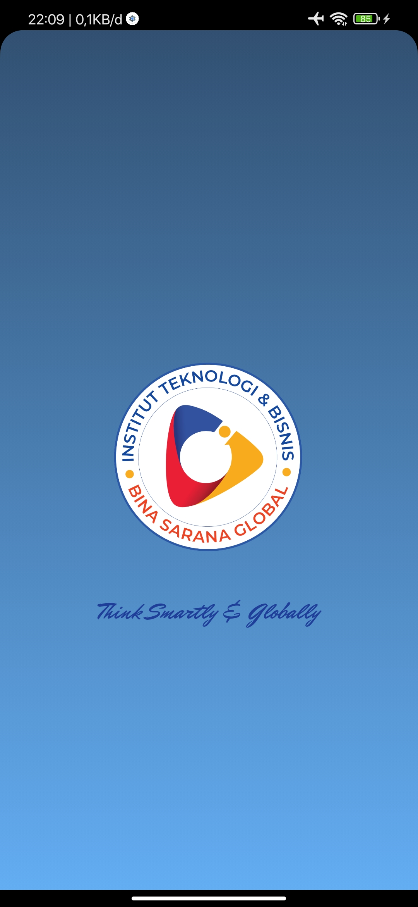
  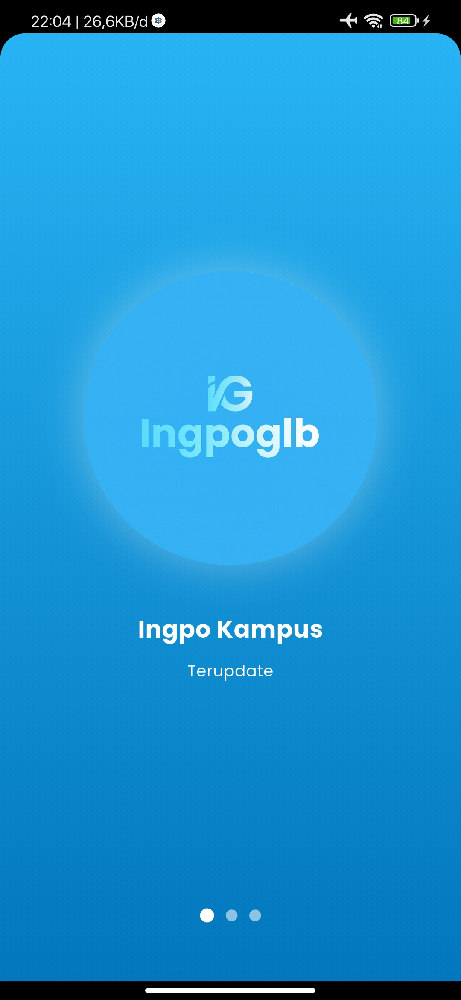
  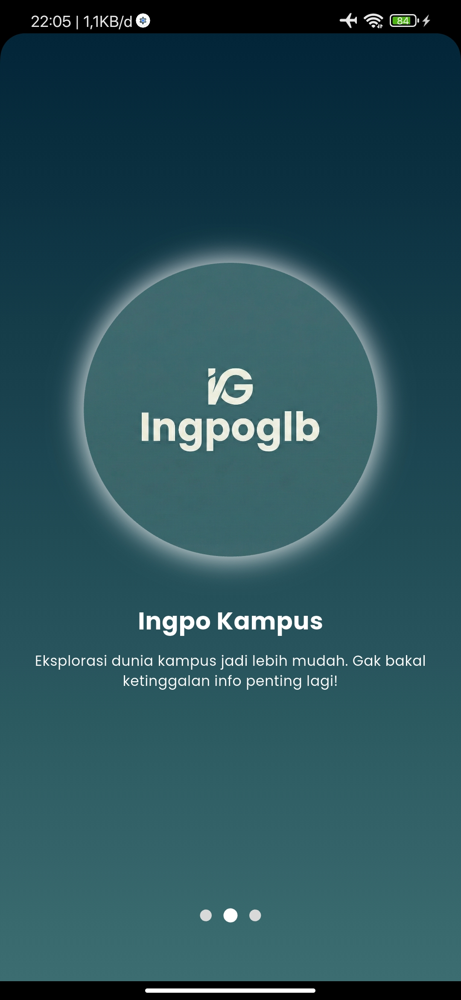
  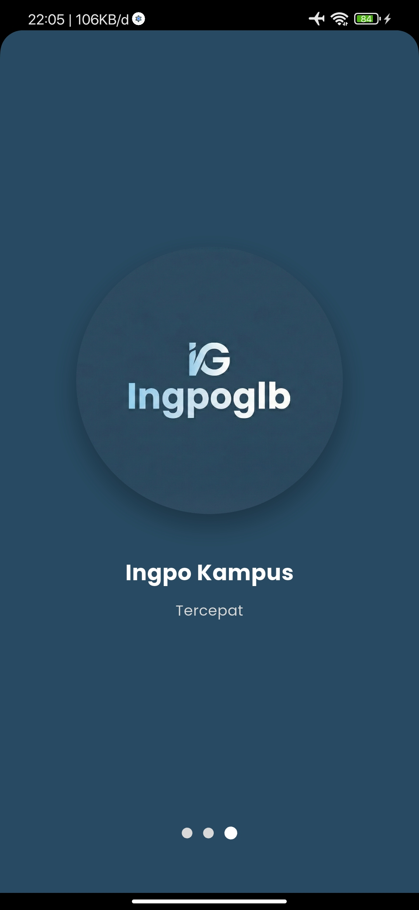
</p>

**Login**
<p align="center">
  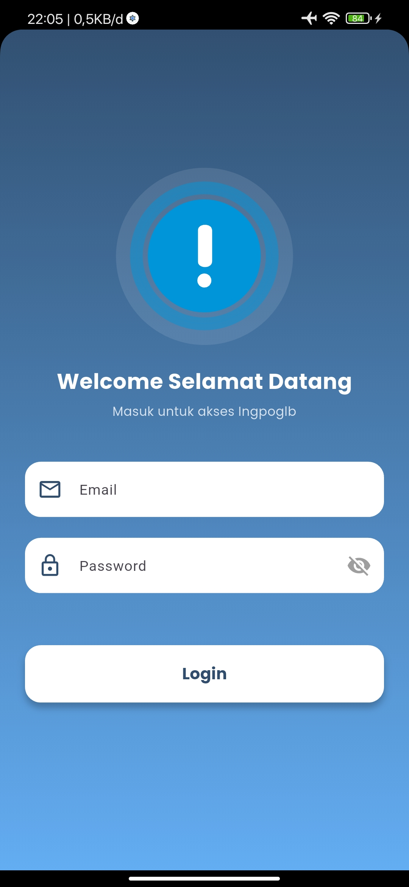
</p>

**Dashboard**
<p align="center">
  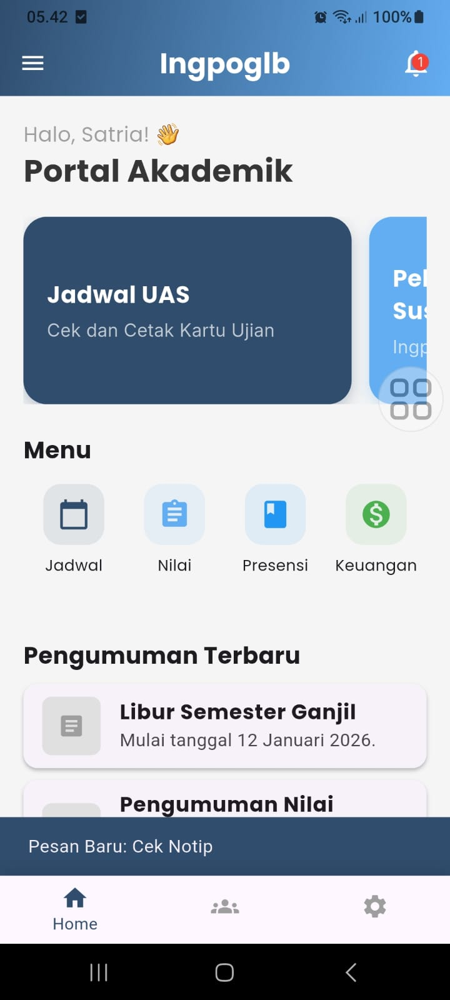
  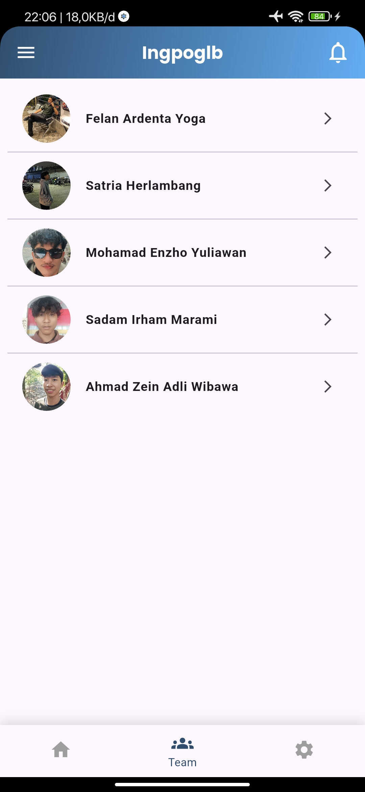
  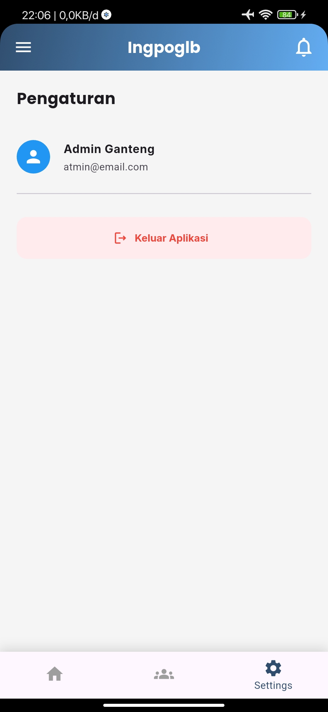
  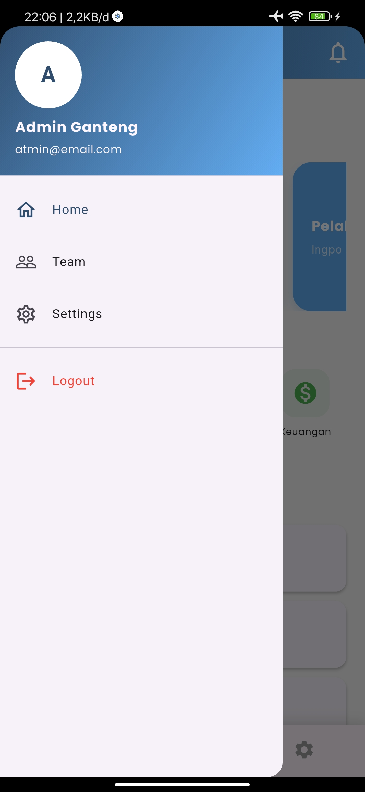
</p>

**Profiles**
<p align="center">
  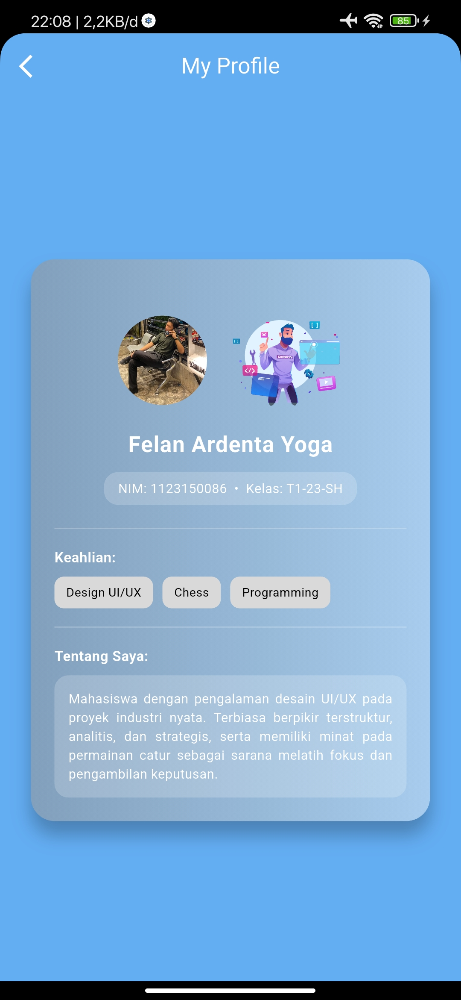
  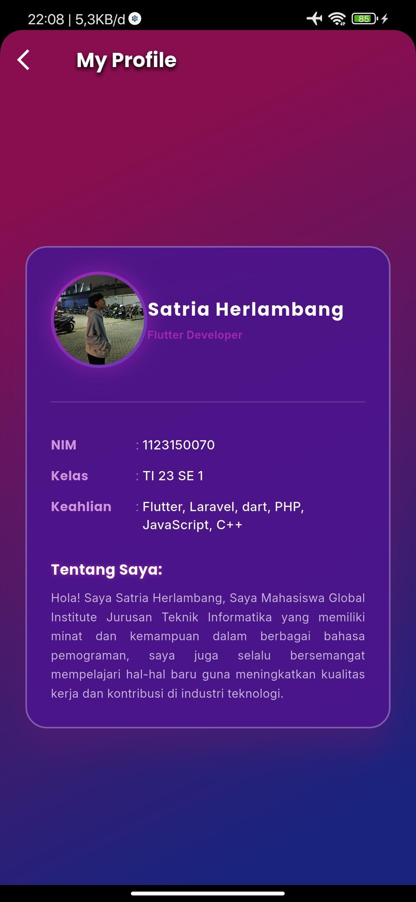
  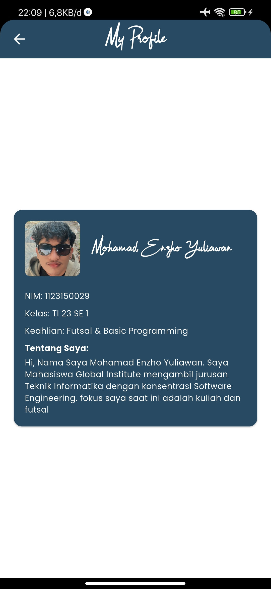
  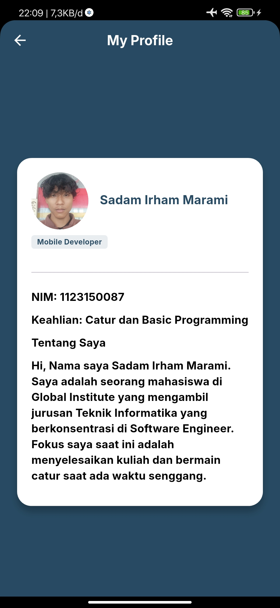
  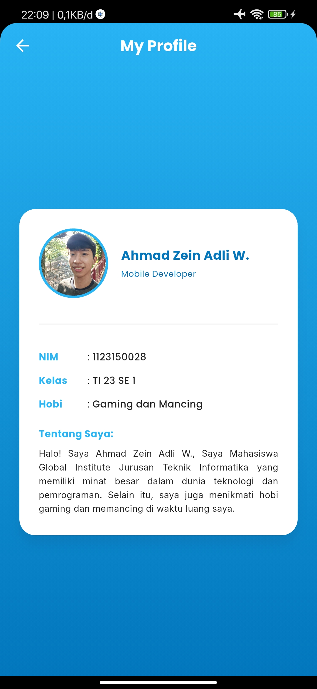
</p>

---

## 👥 Team Development

| No | NIM | Nama | Role                  |
| :--- | :--- | :--- |:----------------------|
| 1. | 1123150070 | Satria Herlambang | `Team Leader`         |
| 2. | 1123150028 | Ahmad Zein Adli W. | `Mobile Developer`    |
| 3. | 1123150029 | Mohamad Enzho Yuliawan | `Fullstack Developer` |
| 4. | 1123150086 | Felan Ardenta Yoga | `UI/UX Designer`      |
| 5. | 1123150087 | Sadam Irham Marami | `Backend Integration` |

---

## Demo Video

**[Watch Full Demo on YouTube](https://youtu.be/fuWr6jkIZYA?si=MzaGgmygRvTUaXS6)**

---

## Download Aplikasi

### Latest Release v1.0.0
- [**Download APK**](https://github.com/str122-xyz/Kelompok-4-trio/releases/download/v1.0.0/Ingpoglb-v1.0.0.apk)

---

## Built With

- **[Flutter](https://flutter.dev/)** - UI Framework
- **[Dart](https://dart.dev/)** - Programming Language
- **[Firebase](https://firebase.google.com/)** - Backend & Authentication
- **[SQLite](https://www.sqlite.org/)** - Local Database
- **[Provider](https://pub.dev/packages/provider)** - State Management

---

## Getting Started

### Prerequisites

Pastikan Anda sudah menginstall:
- Flutter SDK (3.16.0 or higher)
- Dart SDK (3.2.0 or higher)
- Android Studio / VS Code
- Git

## 🚀 Cara Instalasi & Menjalankan

**1. Clone Repository**
```bash
git clone https://github.com/str122-xyz/Kelompok-4-trio.git
cd ingpoglb-app
```

**2. Install Dependencies**
```bash
    flutter clean
    flutter pub get
```

**3. Jalankan Aplikasi**
```bash
    flutter run
```

---

## Flow

```
1. Splash Screen (Auto-login check)
   ↓
2. Login Screen
   ↓
3. Home Page (Dashboard)
   ↓
4. Team List
   ↓
5. Settings (Logout)
```

---

## 📁 Struktur Project

```
lib/
├── main.dart                   # Entry point aplikasi
├── firebase_options.dart       # Konfigurasi Firebase
├── models/                     # Data models
├── services/                   # Business logic (Auth)
└── screens/                    # UI Screens & Pages
    ├── auth/                   # Halaman Login
    ├── dashboard/              # Halaman Utama & Fitur Kampus
    ├── splash/                 # Halaman Splash & Onboarding
    └── team/                   # Halaman Profil Developer (Kelompok 4 Trio)
```

---

<div align="center">
  <p>Made with by Kelompok 4 Trio</p>
  <p>© 2026 Ingpoglb. All rights reserved.</p>
</div>
